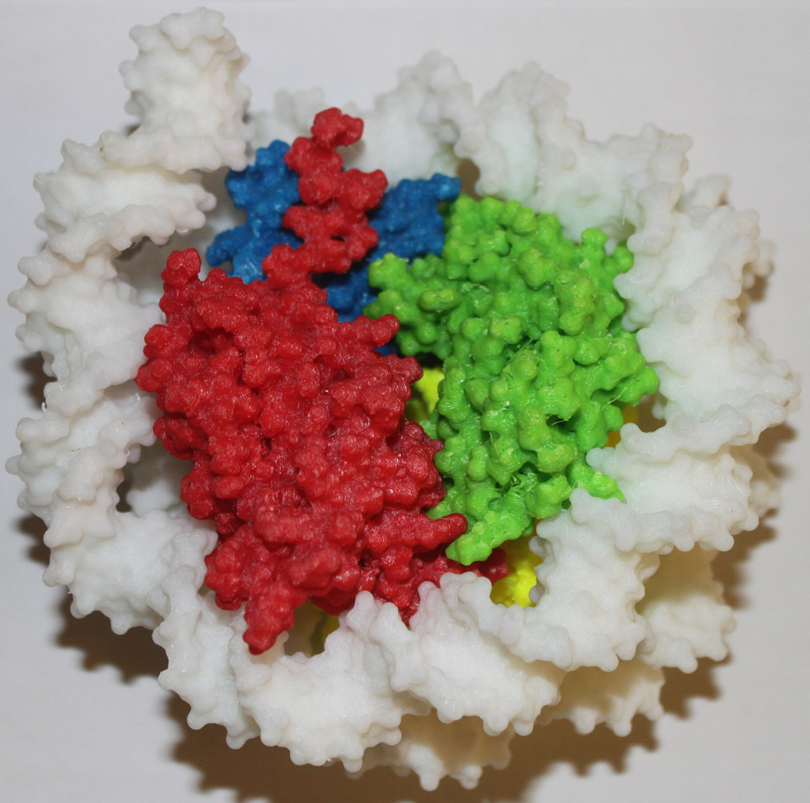

nuclLEGO
========

Nucleosome LEGO project: 3D printed models of nucleosomes
--------

The goal of the project is to create 3D printed models of nucleosomes that can be assembled from separately printed parts.

Model variants
--------
DNA_and_dimers - version of nucleosome model that have separatly printed DNA and 4 histone dimers.
Model desription:
https://github.com/molsim/nuclLEGO/blob/master/DNA_and_dimers/manual.pdf?raw=true

DNA_and_monomers - version of nucleosome model that have separatly printed DNA and 8 histone monomers, for print on a two color printer.

Check videos
-------
http://youtu.be/BVYtnfIcnH4

Photo of a model
-------

